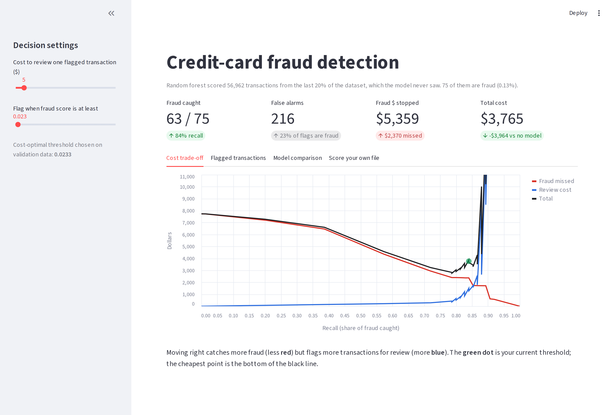

# Credit Card Fraud Detection

A machine-learning model that flags fraudulent card transactions, plus a dashboard for choosing how aggressive it should be based on what fraud and false alarms actually cost.



## The problem

Only **0.17%** of transactions are fraud. A model that never flags anything is 99.8% accurate and completely useless, so this project measures **precision-recall AUC** and **dollars saved** instead of accuracy.

## Results

Built with the first 80% of transactions by time (64% training, 16% validation) and tested on the last 20%, which the model never saw.

| Model | PR-AUC | Recall at 90% precision |
| --- | --- | --- |
| Logistic regression | 0.737 | 69% |
| Gradient boosting | 0.800 | 75% |
| **Random forest** | **0.807** | **76%** |

**Choosing the threshold by cost** (assuming each flagged transaction costs $5 to review):

| | Frauds caught | False alarms | Total cost |
| --- | --- | --- | --- |
| No model | 0 / 75 | 0 | $7,729 |
| Default threshold (0.5) | 51 / 75 | 1 | $4,202 |
| **Cost-optimized threshold** | **63 / 75** | 216 | **$3,765** |

The cost-optimized threshold catches 12 more frauds than the default and cuts total losses by **51%** compared with no model. The threshold was picked on validation data, so it isn't the exact cheapest point on the test data. That's expected: the test set was never used to tune anything.

## How it works

1. **Split by time, not at random.** A real model only scores future transactions, so testing on later data gives an honest result.
2. **Engineered features:** log of the amount, and time of day encoded so 11 PM and midnight are close together.
3. **Class weights** handle the imbalance instead of oversampling.
4. **Model and threshold are chosen on a validation set.** The test set is only used once, for the final numbers.

Data exploration is in [`notebooks/01_explore_data.ipynb`](notebooks/01_explore_data.ipynb).

## Built with

Python · scikit-learn · pandas · Streamlit · Altair · Matplotlib · pytest · GitHub Actions

## Run it

```bash
python3 -m venv .venv && source .venv/bin/activate
pip install -r requirements-dev.txt

# Download creditcard.csv into data/ (see data/README.md), then:
PYTHONPATH=src python -m fraud.train
streamlit run app/streamlit_app.py
```

No dataset? `PYTHONPATH=src python -m fraud.train --synthetic` runs everything on fake data.

## Data

[Credit Card Fraud Detection](https://www.kaggle.com/datasets/mlg-ulb/creditcardfraud) by the ULB Machine Learning Group: 284,807 European card transactions from September 2013, 492 of them fraud. Most features are anonymized (PCA), so the model can't explain *why* a transaction looks suspicious in plain terms.
